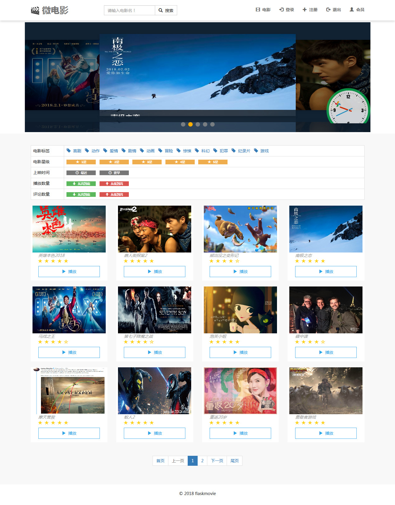
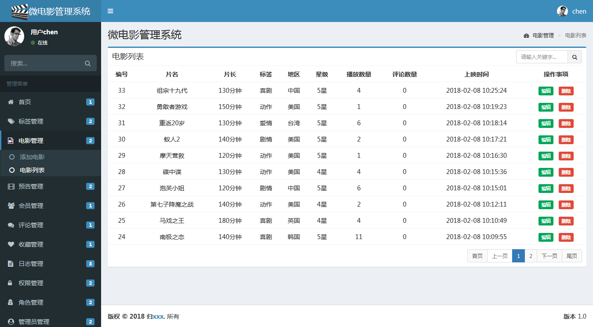
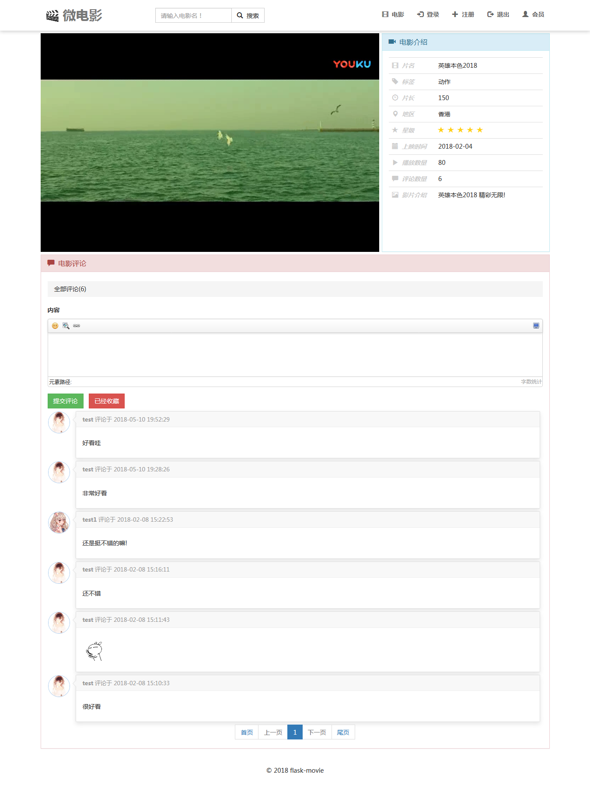

# flask-movie

#### Online movie project
#### 项目地址: http://movie.silence321.com (测试账号:test 密码:123456)
#### 管理员后台地址: http://movie.silence321.com/admin (账号:chen 密码:123456)

 
### 1、工具: 在线微电影播放网站  flask+python3.6+mysql+pycharm
 

### 2、主要实现功能：

### admin后台模块:
1,标签(分类)管理 
2,电影管理 
3,预告管理(首页轮播预告图片) 
4,会员(用户)管理 
5,评论管理 
6,收藏管理 
7,日志管理(后台操作日志,用户登录日志,管理员登录日志) 
8,权限管理 
9,角色管理 
10,管理员管理 
 

 
 
 
 

### home前台模块:
1,用户注册,登录 
2,会员中心(资料编辑,修改密码,评论记录,登录日志,收藏电影) 
3,电影轮播预告 
4,电影名称搜索 
5,电影筛选(分类,星级,上映时间,播放数量,评论数量) 
6,电影播放,评论,收藏 
 

 

 
### 3、项目目录结构：

    +--app
    |      +--admin
    |      |      +--forms.py
    |      |      +--views.py
    |      |      +--__init__.py
    |      |      +--__pycache__
    |      +--home
    |      |      +--forms.py
    |      |      +--views.py
    |      |      +--__init__.py
    |      |      +--__pycache__
    |      +--models.py
    |      +--static
    |      |      +--404
    |      |      +--admin
    |      |      +--anim
    |      |      +--base
    |      |      +--fonts
    |      |      +--ionicons
    |      |      +--js
    |      |      +--jwplayer
    |      |      +--lazyload
    |      |      +--ueditor
    |      |      +--uploads
    |      |      +--video
    |      +--templates
    |      |      +--admin
    |      |      |      +--admin.html
    |      |      |      +--adminloginlog_list.html
    |      |      |      +--admin_add.html
    |      |      |      +--admin_list.html
    |      |      |      +--auth_add.html
    |      |      |      +--auth_edit.html
    |      |      |      +--auth_list.html
    |      |      |      +--comment_list.html
    |      |      |      +--grid.html
    |      |      |      +--index.html
    |      |      |      +--login.html
    |      |      |      +--moviecol_list.html
    |      |      |      +--movie_add.html
    |      |      |      +--movie_edit.html
    |      |      |      +--movie_list.html
    |      |      |      +--oplog_list.html
    |      |      |      +--preview_add.html
    |      |      |      +--preview_edit.html
    |      |      |      +--preview_list.html
    |      |      |      +--pwd.html
    |      |      |      +--role_add.html
    |      |      |      +--role_edit.html
    |      |      |      +--role_list.html
    |      |      |      +--tag_add.html
    |      |      |      +--tag_edit.html
    |      |      |      +--tag_list.html
    |      |      |      +--userloginlog_list.html
    |      |      |      +--user_list.html
    |      |      |      +--user_view.html
    |      |      +--home
    |      |      |      +--404.html
    |      |      |      +--animation.html
    |      |      |      +--comments.html
    |      |      |      +--home.html
    |      |      |      +--index.html
    |      |      |      +--layout.html
    |      |      |      +--login.html
    |      |      |      +--loginlog.html
    |      |      |      +--menu.html
    |      |      |      +--moviecol.html
    |      |      |      +--play.html
    |      |      |      +--pwd.html
    |      |      |      +--regist.html
    |      |      |      +--search.html
    |      |      |      +--user.html
    |      |      +--ui
    |      |      |      +--admin_page.html
    |      |      |      +--comment_page.html
    |      |      |      +--home_page.html
    |      |      |      +--search_page.html
    |      +--__init__.py
    +--movie.py
    
    
